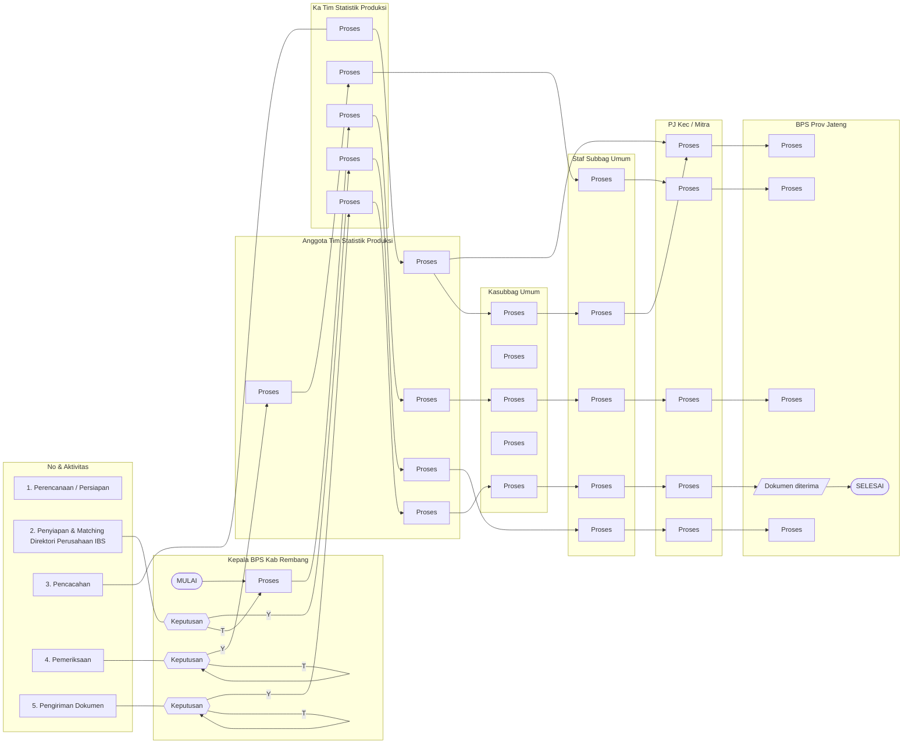

Ah sip 👍 error itu muncul karena Mermaid **nggak boleh ada teks komentar (`%% ...`) setelah perintah node/link**.
Aku bersihin syntax-nya dan sederhanakan biar bisa langsung di-render.

Coba pakai versi berikut ini (sudah aku rapikan supaya valid):

⚡ Coba render lagi di [Mermaid Live Editor](https://mermaid.live).
Kalau sukses, aku bisa lanjut tambahkan isi detail “Mutu Baku” (persyaratan, waktu, output) ke flowchart ini juga biar tabel kanan ikut divisualkan.

Mau aku tambahkan langsung juga bagian “Mutu Baku”-nya ke dalam diagram atau dijadikan tabel terpisah biar lebih rapi?
