Sip, aku bikinkan flowchart versi **opsi 1 (linear, vertikal)** yang ringkas, sudah aku gabungkan juga dengan informasi dari tabel **Mutu Baku** (Persyaratan, Waktu, Output) langsung di dalam kotak aktivitasnya biar sekali lihat sudah jelas.

Silakan coba render kode berikut di [Mermaid Live Editor](https://mermaid.live):

```mermaid
flowchart TD
    Start([MULAI])

    A1["1. Perencanaan / Persiapan
    Pelaku: Kepala BPS, Ka Tim, Anggota, Kasubbag, Staf, PJ Kec, BPS Prov
    Persyaratan: POK, DIPA/DPA BPS, Dokumen Surat, ATK
    Waktu: 7 hari (Des t-1 / Jan t)
    Output: Rencana anggaran & kelengkapan administrasi"]

    A2["2. Penyiapan & Matching Direktori
    Pelaku: Kepala BPS, Ka Tim, Anggota, Staf, PJ Kec, BPS Prov
    Persyaratan: Surat Tugas, Surat Pengantar Pengambilan Direktori, Daftar IKB, ATK
    Waktu: 1 bulan (Jan–Feb)
    Output: Direktori Perusahaan IBS"]

    A3["3. Pencacahan
    Pelaku: Ka Tim, Anggota, PJ Kec, Kasubbag, Staf, BPS Prov
    Persyaratan: Daftar IA, IB, I, B & ATK; Surat Tugas
    Waktu: 1 bulan (Feb–Jun)
    Output: Daftar IB baru / terisi"]

    A4["4. Pemeriksaan
    Pelaku: Kepala BPS, Ka Tim, Anggota, Staf, PJ Kec, BPS Prov
    Persyaratan: Daftar IA/IB lama; ATK; Surat Tugas
    Waktu: 1 bulan (Mei–Jul)
    Output: Daftar IA/IB terisi lengkap"]

    A5["5. Pengiriman Dokumen
    Pelaku: Kepala BPS, Ka Tim, Anggota, Kasubbag, Staf, PJ Kec, BPS Prov
    Persyaratan: Daftar IA/IB lama/baru siap kirim
    Waktu: 2 hari (Mei–Jul)
    Output: Dokumen diterima BPS Prov"]

    End([SELESAI])

    Start --> A1 --> A2 --> A3 --> A4 --> A5 --> End
```

📌 Hasilnya akan lebih ringkas (alur dari atas ke bawah), semua pelaku & informasi penting masuk dalam tiap kotak, jadi cocok ditempel ke dokumen tanpa kepanjangan ke samping.

Mau saya bikinkan juga versi **tabel ringkasan** (biar gampang dibaca teksnya) untuk melengkapi flowchart ini?
